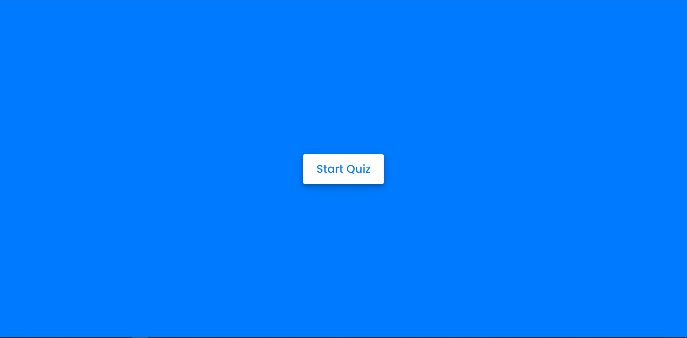
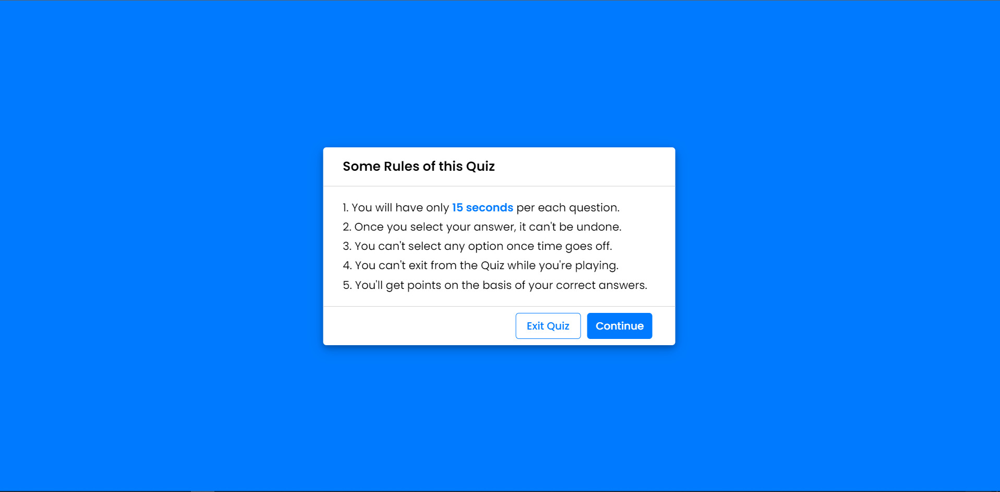
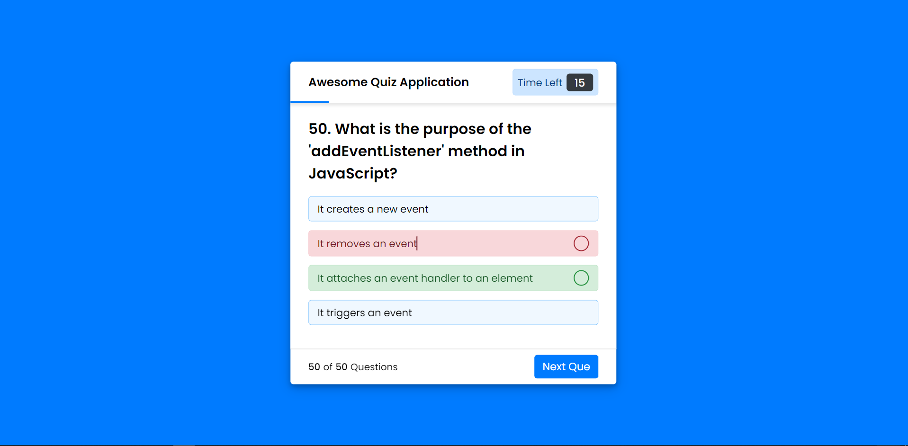
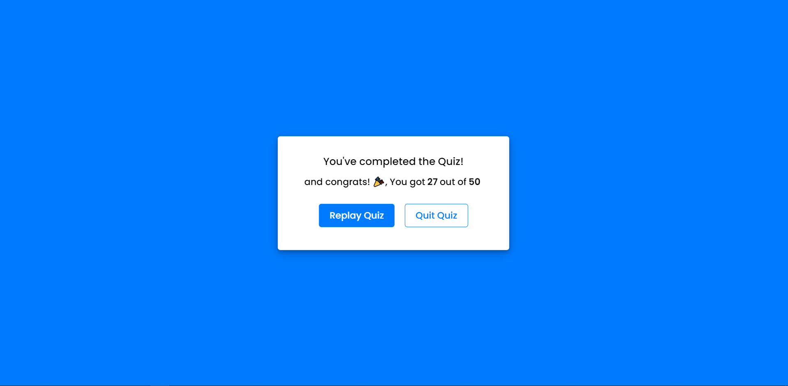

# Quiz App

The Quiz App is a web-based application that allows users to test their knowledge on Javascript.

## Features

- Each quiz consists of multiple-choice questions with randomized options.
- Get instant feedback on your answers and see your score at the end of each quiz.
- Each Question is timed, this improves your brain processing speed.
- User-friendly interface designed for seamless navigation and interaction.

## Technologies Used

- HTML for the structure
- CSS for the design
- JS for the interactivity

## Installation

1. Clone this repository: `git clone https://github.com/udohufak/Quiz-App.git`
2. Navigate to the project directory: `cd quiz-app`
3. Install dependencies: `npm install`
4. Set up your MongoDB database and configure the connection in `config.js`.
5. Start the server: `npm start`

## Contributing

Contributions are welcome! If you have any suggestions, improvements, or new features to add, please fork the repository and create a pull request. Make sure to follow the project's coding guidelines and conventions.

## Live Link

https://udohufak.github.io/Quiz-App/

## Acknowledgment

Special thanks to [Miss Jolah](github.com/Jolah1) for the challenge

## License

This project is licensed under the MIT License - see the [LICENSE](LICENSE) file for details.
